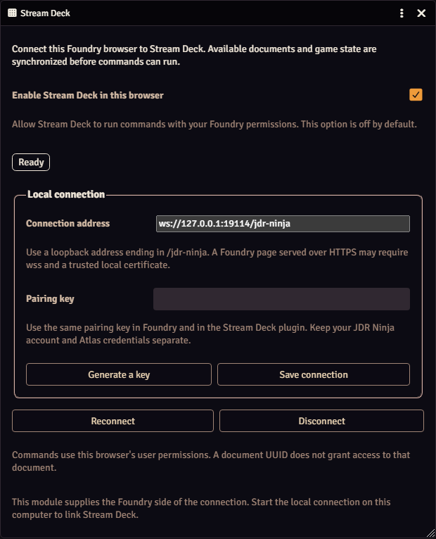
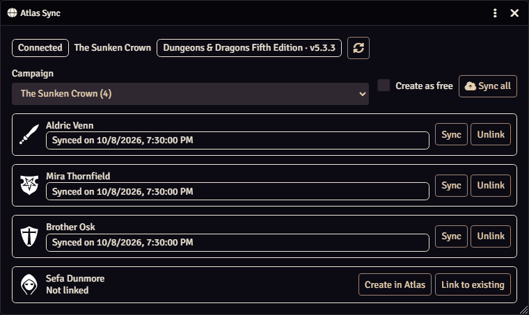
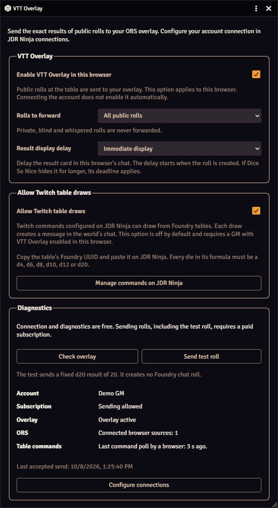
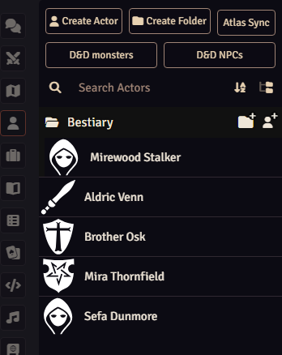
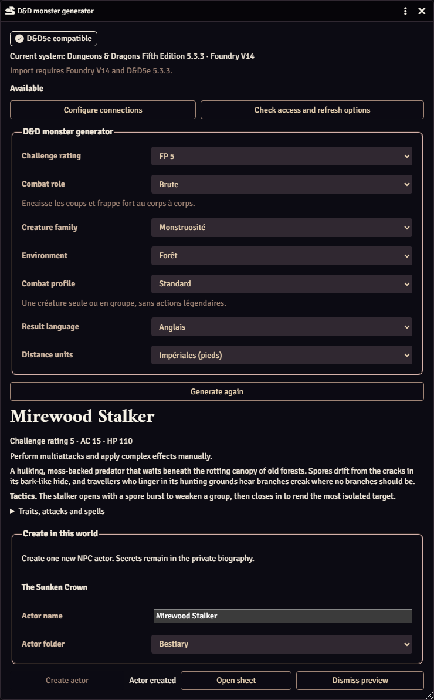
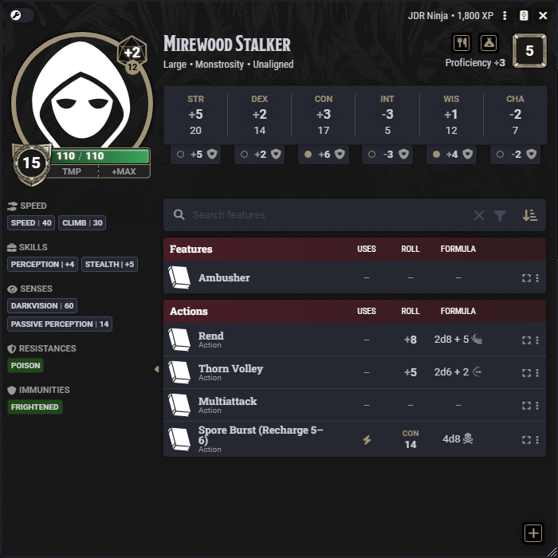
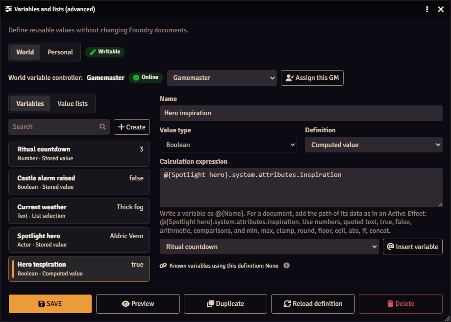
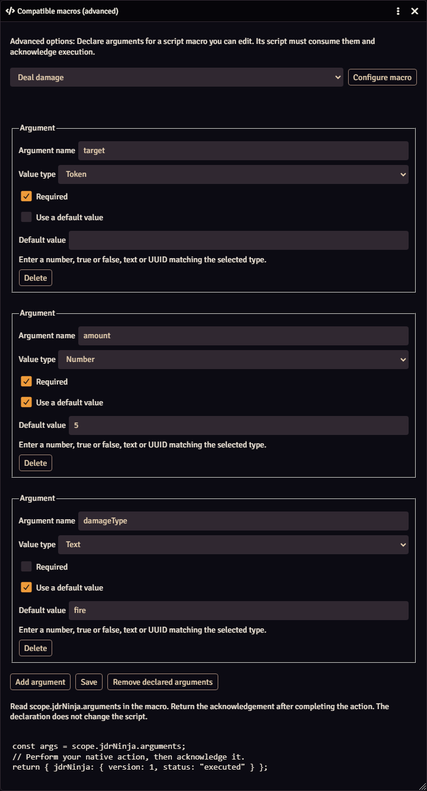
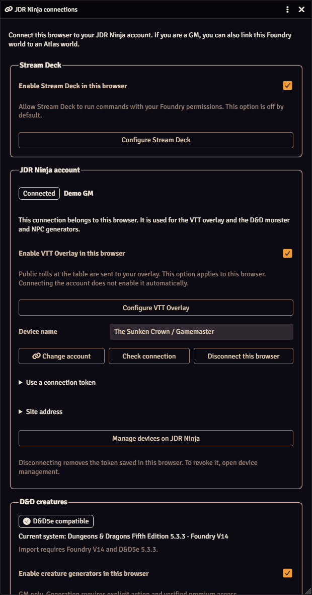

# JDR Ninja for Foundry VTT

**Control your table. Sync your characters. Bring your rolls to the stream.**

An extension of the [JDR Ninja website](https://www.jdr.ninja), this module brings
the site's features directly into **Foundry VTT V14**.

Stream Deck control, Atlas character sync, live dice overlays, and procedural D&D
creature generation in one module.

## Stream Deck: control Foundry with a button

**Control your character sheets from your Stream Deck.** Toggle inspiration,
spend a resource, or change any field you are allowed to edit, with one key.

Switch scenes, cue music, run macros, roll dice, and manage combat from your
**Elgato Stream Deck**. Open character sheets, target tokens, adjust resources,
and share journal pages without hunting through windows.

Buttons can follow your selected token or assigned character, with live game
state for feedback. Commands respect your Foundry permissions.

Requires the **JDR Ninja Stream Deck plugin and local companion**, installed
separately. Local Foundry control does not require a JDR Ninja account.



[Set up Stream Deck →](https://www.jdr.ninja/en/guide-stream-deck-foundry)

## Atlas: keep your campaign's characters up to date

Link Foundry actors to **Atlas** characters, create new ones, and sync sheets
and portraits individually or together.

Supports **D&D5e, Pathfinder 2e, Starfinder 2e, The One Ring 2e, and WFRP4e**.
Synchronization is managed by the GM.



[Connect Atlas →](https://www.jdr.ninja/en/integration-foundry/guide#connecter-atlas)

## VTT Overlay: put your rolls on stream

Show your **actual public Foundry rolls in OBS**, coordinated with **Dice So Nice**.
Filter to player rolls, adjust chat-card timing, and let Twitch commands draw
from approved RollTables.

Private rolls stay private. Live overlay rolls require a paid subscription.



[Set up the overlay →](https://www.jdr.ninja/en/integration-foundry/guide#activer-les-fonctions)

## D&D generators: from idea to Foundry actor

Use **procedural generation** to create a **monster or NPC**, preview the result,
and import it as a native Foundry actor with its items and activities.

GM-only, with premium access. Requires **Foundry V14 and D&D5e 5.3.3**.







[Connect the generators →](https://www.jdr.ninja/en/integration-foundry/guide#activer-les-fonctions)

## Advanced controls: make your buttons go further

Reuse counters, toggles, text, document references, and lists. Feed values into
commands, define computed variables, and pass typed arguments to compatible macros.

The variable and macro editors also work locally without a Stream Deck connection.

Computed variables read document data with the same paths as Active Effects, such as
`@{Spotlight hero}.system.attributes.inspiration`. To find the path of a value, the
[Document Data Explorer](https://foundryvtt.com/packages/document-data-explorer) module
shows the data structure of any document from its sheet.





[Explore advanced controls →](https://www.jdr.ninja/en/guide-stream-deck-foundry#options-avancees)

## Get started

1. Install the module using this manifest URL:

   ```text
   https://github.com/JDR-Ninja/fvtt-jdr-ninja/releases/latest/download/module.json
   ```

2. Enable **JDR Ninja** in your Foundry world.
3. Open **Configure Settings → JDR Ninja → Configure connections** and enable
   the features you want. Each integration starts disabled.



**Languages:** English, French, Spanish, German, and Italian.

[Installation and connection guide →](https://www.jdr.ninja/en/integration-foundry/guide)
· [JDR Ninja](https://www.jdr.ninja/en)

## Screenshots

Screenshots show invented demo content in Foundry VTT V14 with D&D5e 5.3.3.
Character portraits are Foundry VTT icons from [game-icons.net](https://game-icons.net),
created by [various authors](https://game-icons.net/about.html#authors) and licensed under
[CC BY 3.0](https://creativecommons.org/licenses/by/3.0/).
